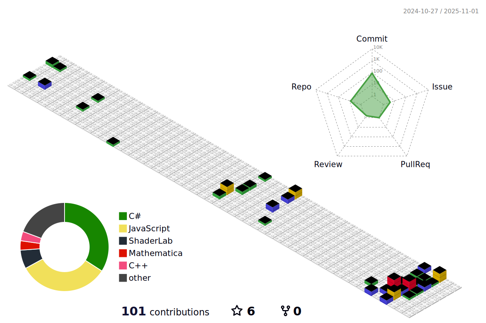

<h1 align="center">
  
</h1>

  

  
  
  
  

  

---

 
  
<h2>👋 About Me</h2>

  
   
  
  Hey! I'm a game developer who recently graduated in Game Design & Development. I've been making games since my second year of university, though back then it was more sporadic. Now I'm really diving deep into game development and building up my portfolio with projects I'm genuinely proud of.
  
  I work mainly with Unity and Unreal Engine 5, and I'm particularly interested in game physics, making games feel good to play, and squeezing out every bit of performance I can. There's something really satisfying about nailing that perfect game feel.
  
  **Some things I've done:**
  - 🎓 Graduated in Game Design & Development
  - 🥉 Third place at the Concurso de Desarrollo de Videojuegos por la Transición Ecológica (2021)
  - 🎮 Worked with Unity and Unreal Engine 5 on various projects
  - 🎯 Participated in game jams: GGJ 2023, UJI Game Jam 2021 & 2024
  
  **What I'm into:**
  - Creating gameplay that just clicks with players
  - Tackling tricky technical problems (the kind that keep you up at night)
  - Learning new tools and techniques - the game dev world moves fast!
  - Building cool indie games and expanding my portfolio
  - Connecting with other devs and being part of the community
    

 
  
<h2>🛠️ Technologies & Tools</h2>

  <h3>👨‍💻 Programming Languages</h3>
  
  

    
    
    
    
    
    
    
  

  <h3>🎮 Game Engines & Frameworks</h3>
  
  

    
    
    
  

  <h3>📦 Unity Packages & Tools</h3>
  
  

    
    
    
    
    
  

  <h3>🗄️ Databases & Cloud</h3>
  
  

    
     
    
  

  <h3>💻 Development Tools & Software</h3>
  
  

    
    
    
    
    
    
    
    
    
    
  

  <h3>🎨 Creative & Design Tools</h3>
  
  

    
    
    
    
    
    
  

  <h3>🌐 Other Tools</h3>
  
  

    
  

 
  
<h2>🮠Game Jams & Events</h2>

  
   
  
  | Event Name | Year | Role | Achievement |
  |------------|------|------|-------------|
  | **GGJ Shawnee State University** | 2023 | Participant | Developed a complete game prototype in 48 hours |
  | **Concurso de Desarrollo de Videojuegos por la Transición Ecológica** | 2021 | Participant | 🥉 **Third Place** |
  | **UJI Game Jam** | 2021, 2024 | Participant | Created innovative game concepts under time constraints |
  

 
  
<h2>📊 Stats & Activity</h2>

  
   
  
  
  

---

  <i>💡 "Practical code. Playable games"</i>

